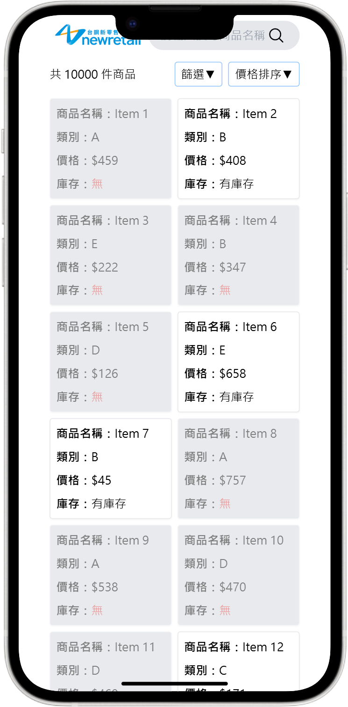
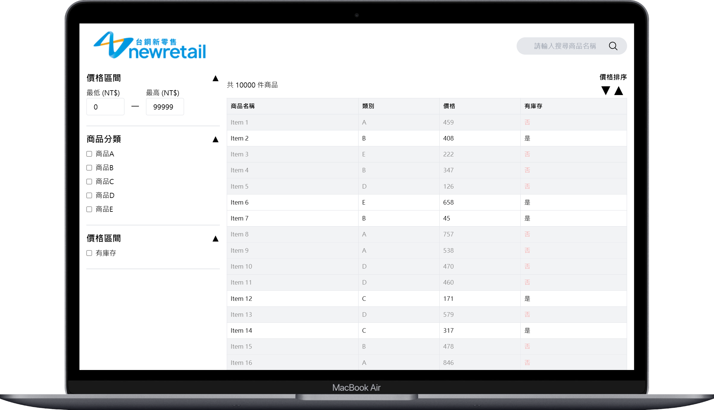

# 🛒 newRetail 電商專案

本專案使用 React + TypeScript 開發電商前端系統，模擬商品展示、篩選、搜尋與分頁等完整功能，搭配 Tailwind CSS 進行響應式切版，專為高效瀏覽大量商品（10,000 筆以上）而設計。

## 🚀 技術棧

- **React** v18.3.1
- **TypeScript**
- **Tailwind CSS**
- **Vite**

## 🌐 線上展示（GitHub Pages）

🔗 [Live Demo – 點我觀看](https://corycory1234.github.io/newRetail/)  

## 🖼️ 專案畫面截圖

| 商品列表（含分頁）
|--------------------|------------------|
| <div align="center">   </div>|

> 📌 建議圖片尺寸為 800px 寬，可存放於 `public/` 目錄。

## 💡 專案特色與最佳實踐

### 🔁 效能優化

- **`useMemo` 大量使用**  
  為避免 10,000 筆商品重複渲染，對篩選與計算相關的資料皆進行記憶體緩存處理，大幅提升效能與使用者體驗。

- **`Map` 构建 Hash Table**  
  商品類別篩選邏輯使用 `Map` 儲存唯一 Key 值，比起陣列過濾能有效降低時間與空間複雜度。

- **Debounce 防抖處理**  
  對關鍵字與價格範圍 `<input>` 設置 300–500ms 防抖延遲，避免頻繁觸發渲染或 API 請求，提升效能並減少後端負擔。

### 🔍 搜尋與資料處理

- **商品名稱預處理**  
  針對商品名稱中的空格（如 "item 1"），透過正則處理統一格式，提升關鍵字搜尋的命中率。

- **防止空白搜尋**  
  若使用者輸入僅為空白字串，將不會觸發搜尋，避免無效請求。

### 📄 分頁邏輯

- 將 10,000 筆資料依照每頁 20 筆，動態分頁顯示。
- 採用滑動視窗機制（如當前為第 2 頁，顯示頁碼為 2～6），維持頁碼顯示清晰且不擁擠。

### 🧩 元件設計

- **元件模組化拆分**  
  `filterPage.tsx` 負責主邏輯，UI 元件皆獨立拆分為可複用 Components，保持程式碼簡潔易維護。

- **Modal 通用彈跳視窗**  
  自訂 `modal.tsx`，用於分類篩選與排序選單等場景，提升元件複用性與一致性。

### 🧠 嚴謹型別系統

- 使用 TypeScript 綁定所有資料與元件型別，強化開發時的錯誤檢查與 IDE 智能提示。

### 🖼️ 響應式設計（Tailwind）

- 搭配 Tailwind CSS 實作不同裝置的版面配置：
  - `sm: 375px`（手機）
  - `md: 768px`（平板）
  - `lg: 1024px`（筆電）
  - `xl: 1280px`（桌機）

## 📁 專案結構

newRetail/
├── public/ # 靜態資源（含截圖）
├── src/
│ ├── components/ # 元件區
│ ├── json/ # 模擬商品資料
│ ├── types/ # TypeScript 型別定義
│ ├── pages/
│ │ └── filterPage.tsx # 篩選與分頁主邏輯
│ └── App.tsx # App 主入口
├── tailwind.config.ts # Tailwind 設定
├── vite.config.ts # Vite 設定（含 base 設定）
├── package.json
└── README.md # 專案說明文件


## 📦 安裝與啟動

```bash
# 安裝依賴
npm install

# 啟動開發伺服器
npm run dev

# 部屬專案
npm run deploy
